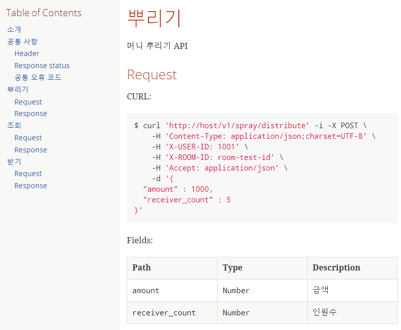
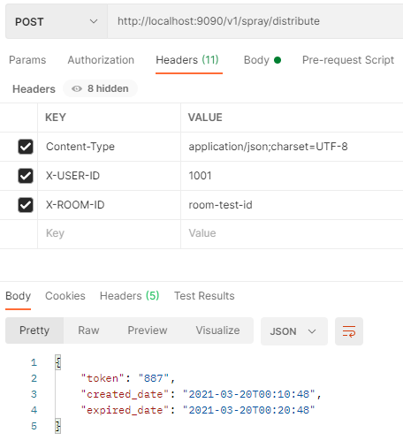
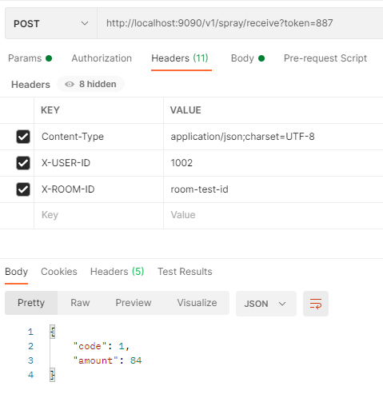
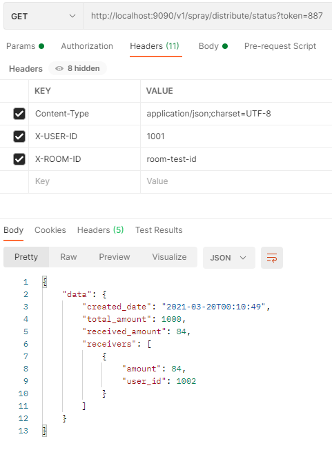

# Assignment Server

---
## 빠른 실행 가이드
```
# ssh : git@github.com:plzhans/test-assignment-kakaopay.git
git clone https://github.com/plzhans/test-assignment-kakaopay.git

# 디렉토리 이동
cd test-assignment-kakaopay

# gradle 빌드
./gradlew build

# 실행
java -jar -Dfile.encoding=UTF-8 assignment-api/build/libs/assignment-api-0.0.1.jar
```
---

## 분석
- 요구 사항 : [docs/plan.md](docs/plan.md)

## 스팩
- JAVA : 1.8
- SpringBoot : 2.3.9
- Build : gradle 
- Test : Junit5
- DB : mysql, redis
  - 개발 환경에서는 h2database 와 [embedded-redis](https://github.com/ozimov/embedded-redis) 를 사용

## 개발

### 토큰
- token 난수는 UUID의 마지막 3자리 사용하도록 함
- 3자리만 사용해서 중복이 발생할 수 있지만 이번 과제에서는 무시함
  
### 분산 서버 
- 분산 서버에서 유저락을 지원하기 위해서 Redis 사용
- 스핀 방식이 아닌 pubsub 기능을 이용한 [redisson](https://github.com/redisson/redisson) 사용  

### 트래픽 및 성능
- 받기 API는 트래픽이 많을 것으로 예상되어 일부 캐시 처리
- token에 대한 받기 가능한 시간까지 redis 키가 유효한지 정도만 체크
- 원래는 어느 정도 정보를 체크하려 했지만 시간 관계상 패스

### 테스트 
- junit5를 이용하여 기본적인 테스트 검증
- 컨트롤러 테스트와 rest docs 생성 
- Service, Repository 테스트
- Module 테스트
- Redis 테스트
- 스크린샷
- 

---
## 멀티 프로젝트
### Common
- Path : [./assignment-common](./assignment-common)
- 공통으로 사용할 모듈 분리
- DB 관련 Entity 포함

### API 
- Path : [./assignment-api](./assignment-api) 
- 머니 뿌리기, 받기, 조회 API
- API 문서는 spring rest docs로 작성
- [API document](https://plzhans.github.io/test-assignment-kakaopay/assignment-api-document.html)
- 

---

## 서버 구성

### Database H2
- 기본 설정은 메모리 데이터베이스(H2)를 사용
- **재시작 한 경우 테스트한 데이터는 초기 상태로 리셋**
- h2 구성은 아래를 참조
  - 스키마 : [schema.sql](./assignment-common/src/main/resources/db/h2/schema.sql)

### Database Mysql

- **h2 db를 사용할 경우 Pass**
- 최초 1회 기본 스키마 등록이 필요
  - 스키마 : [schema.sql](./assignment-common/src/main/resources/db/mysql/schema.sql)
- 환경설정은 [application-mysql.yml](./assignment-api/src/main/resources/application-mysql.yml) 을 참조
  ```yaml
  spring:
    profiles: mysql
    datasource:
      url: jdbc:mysql://{host}:{port}/{database}
      username: {username}
      password: {password}
  ```

### Redis

기본값은 아래 옵션에 의해 embedded redis server를 사용
```yaml
# embed redis server
redis.embedded: true
```

별도의 redis 서버는 아래 설정에 의해 사용 가능
```yaml
# spring
spring:
  # redis 설정
  redis:
    host: localhost
    port: 9080
```

### Docker
mysql 또는 redis 테스트가 필요한 경우 간단히 테스트 가능하도록 docker 처리

- 자세한 내용은 [docker-compose.yml](./docker-compose.yml) 를 참조
  ```
  docker-compose up
  ```
  
- 기본 구성은 mysql port 13306, redis port 16379을 사용하고 docker 설정에서 수정 가능
    ```yaml
    version: "3.7"
    services:
      db:
        image: mysql:5.7
        ports:
        - "13306:3306"
        # ...
      redis:
        image: redis:6.2.1
        ports:
        - "16379:6379"
        # ...
    ```
---

## 빌드

### 전체 빌드
```
gradlew build
```

### 테스트 실행
기본 실행 : h2 db 사용
```
java -jar -Dfile.encoding=UTF-8 assignment-api/build/libs/assignment-api-0.0.1.jar
```

mysql profile 사용하여 시작 : spring.profiles.active=mysql
```
java -jar -Dfile.encoding=UTF-8 -Dspring.profiles.active=mysql assignment-api/build/libs/assignment-api-0.0.1.jar
```

---
## Example
### 뿌리기


### 받기


### 조회

--- 